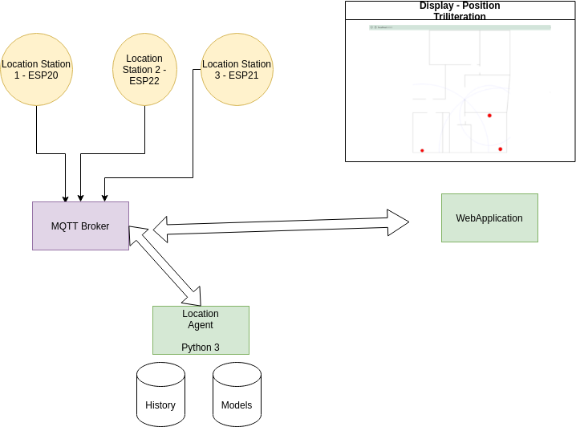
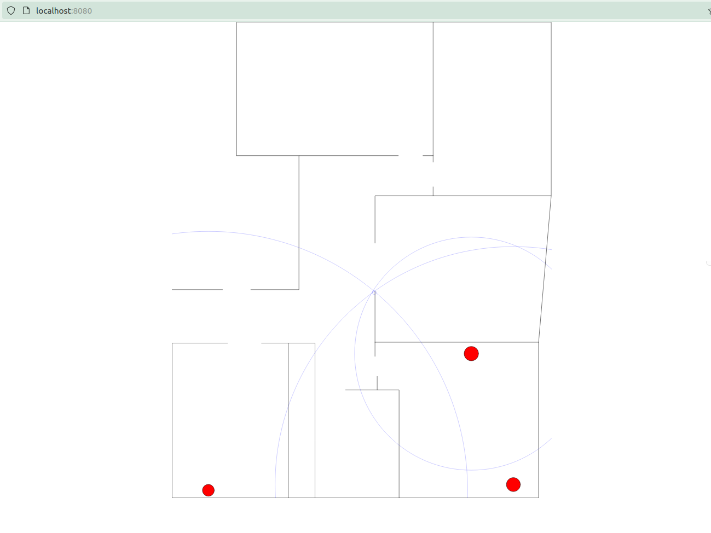
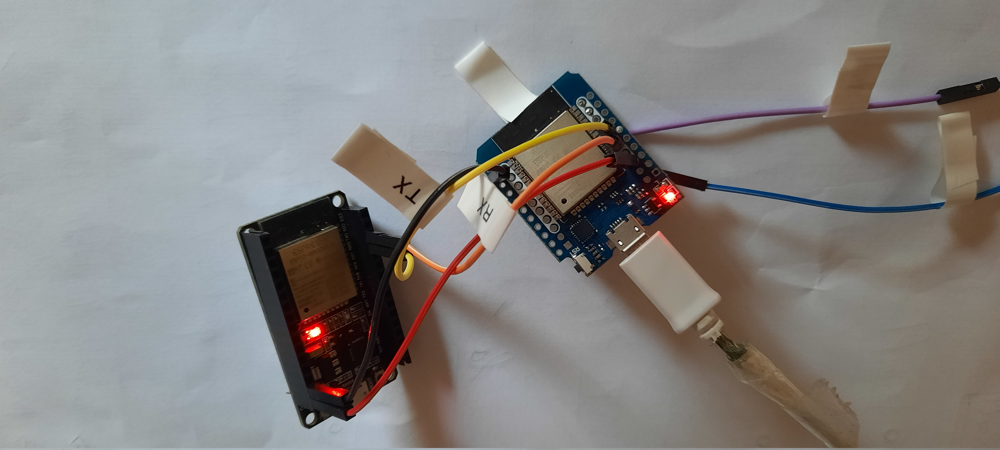
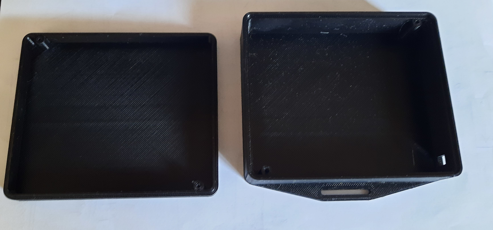
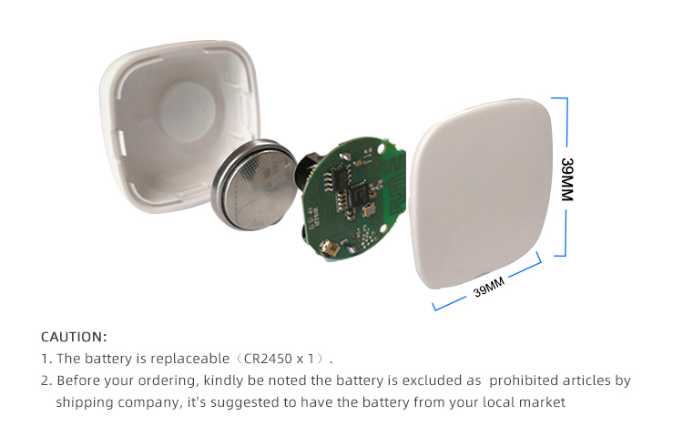
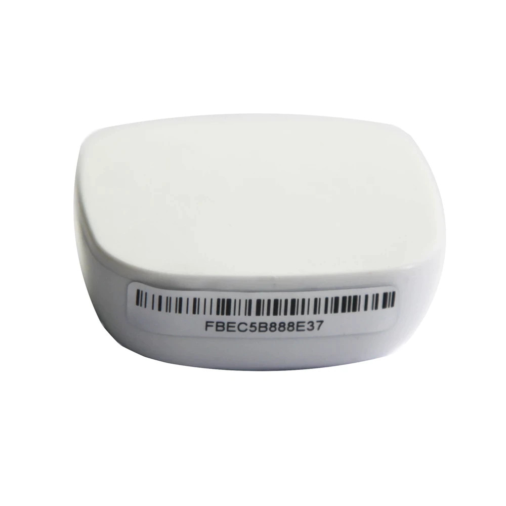
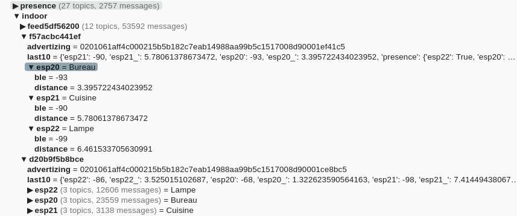
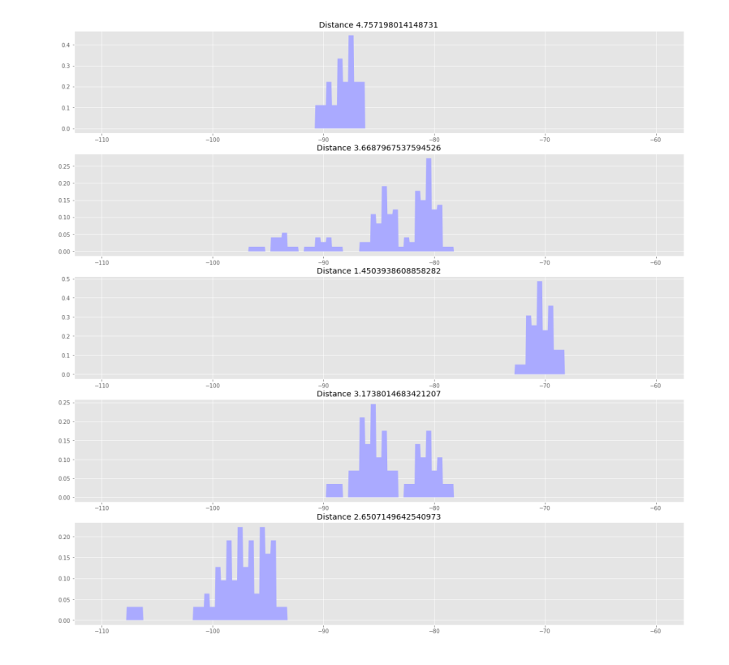

+++
title = "Indoor Location and Cyber Monitoring"
description = "Indoor location system"
date = "2021-11-13"
featured = true

thumbnail = "post/indoor-location/images/belwifistation.jpg"

tags = [
    "indoor", "location", "device"
]
categories = [
    "location"
]

+++


Watching for BlueTooth devices, or Beacon as well as Wifi stations, can be easily done, using a simple ESP32 device.  Several applications of this capability :

- Indoor location
- Presence detection
- Cyber watching the around wifi devices, or stations


<!--more-->


MQTT Iot Stuff published some month ago an ESP32 software (ESP32 promiscuis mode) GitHub repository, monitoring either BLE (Blue Tooth Low energy), and Wifi communication around the ESP32. This monitoring permit to watch the Wifi space and BLE, and grab the emitting information as well as the sender references.

A simple usage of this projet, permit to makes some presence detection, but, using a bit more hardware, indoor location is also possible.

In this setup, the approach use an active ebeacon as the emitter, with no intelligence. This perspective permit to have a lot of ebacon, and the positions can be used in a central way


### The initial ESP32 Promiscious mode and BLE scanning project


[https://github.com/mqttiotstuff/ESP32_promiscuis_mode](https://github.com/mqttiotstuff/ESP32_promiscuis_mode) project implements a serial device scanning both wifi and ble, and log all the communication signature on a 1 000 0000 bauds serial communication. Scanning all wifi channel and with a 10s BLE scanning, main devices are watched and logger.

We are currently experimenting causual usage of this serial device around with the [https://github.com/mqttiotstuff/MyMQTTNodeIOT](https://github.com/mqttiotstuff/MyMQTTNodeIOT) project for logging and transmitting the information to MQTT Broker. 

Some additional usage of this device and associated software will be published soon for several applications : 

1 -  Wifi device detection, preventing intrusion.

2 - BLE Presence detection and indoor location (3 devices has been setup to create ble triangulation, as well as wifi).


## Current Setup

Starting learning about the indoor location, using barebone and commodity hardware, the current setup is as follow. This setup permit to leanr about precision and gather metrics, and possible associated behaviour that can be implemented.




Stations are electronic hardware, monitoring ble / wifi, and publish the information on a mqtt broker. And associated Location Agent, summarize the informations. An additional simple WebApplication, provide the feedback for displaying the location of the beacons, and wifi. 


### Stations

Station are composed of 2 esp32 processors, one for wifi and ble acquisition, communicating in MQTT to a centralized broker for analysis.

These three stations are placed in the inside to cover the needed monitored areas. 



The station positions are marked here in red on the indoor map. To ease the spatial definition, a SVG file has been setup and layers are used to define the stations positions and  


#### Electronic

The board is composed of a master ESP32 weemos, integrating the wifi connexion to MQTT broker on the left. And an individual ESP32 dev, scanning BLE devices and also Wifi pakets.



Communication is done using a simple UART, using a simple error correction protocol. 


#### Casing - PowerSupply

Electronic board is placed inside a 3D printed box, with an integrated 12v -> 5v converter, 




### Beacons used for location

In this setup, beacons used are these ones, cheaper beacons are available but theses products offers, 3 years of battery life, phone and smartphone compatibilty. Range is about 10 m range in an heavy noisy indoor environment. 








This beacon also send some additional informations in the advertizing message, here are the decoded information :

BLE advertizing payload, 

00000000000000000201061aff4c000215b5b182c7eab14988aa99b5c1517008d90001ef41c5

the same payload, decoded by https://reelyactive.github.io/advlib/ online library

```
{
  "type": "ADVA-48",
  "value": "000000000000",
  "advHeader": {
    "type": "ADV_IND",
    "length": 0,
    "txAdd": "public",
    "rxAdd": "public"
  },
  "advData": {
    "flags": [
      "LE General Discoverable Mode",
      "BR/EDR Not Supported"
    ],
    "manufacturerSpecificData": {
      "companyName": "Apple, Inc.",
      "companyIdentifierCode": "004c",
      "data": "0215b5b182c7eab14988aa99b5c1517008d90001ef41c5",
      "iBeacon": {
        "uuid": "b5b182c7eab14988aa99b5c1517008d9",
        "major": "0001",
        "minor": "ef41",
        "txPower": "-59dBm",
        "licenseeName": "Unknown"
      }
    }
  }
}
```


## Agents and applications

#### The location agent (Indoor.py).

This MQTT Python3 agent manage the stations information and consolidate the incoming frames. This agent is hosted on a simple RPI, along with the mqtt broker. It has several responsibilities :

- This agent takes the incoming RAW serial informations, (see project), and convert it to proper isolated MQTT topics, as below:

Published informations are organized by BLE ID, (ie: f57acbc441ef), and publish , as the frames are coming, the associated information BY stations (esp20, esp21, esp22 .. ). A saved model inform about the conversion between the RSSI information and associated distance.




- This agent also create a 10s informations (last10), with the rssi informations and computed distance.
- This agent also manage the recording of positions in calibration (a start/stop external command), saves the positions and known position to be able to fit the created model.


The javascript application display then the informations and make the triliteration to interpolate the position from the measures RSSI and associated distances. Given a device, the application show the distance from the stations, and a small circle show the triliterate position.

<video src="images/application_show.webm" controls autoplay ></video>

Some additional informations are displayed for calibration, and measure checks.

Triliteration algorithm used is the one of 


## Measures and associated Models

Recording the RSSI informations from BLE device (ebeacon), some triggering measures have been observed. The display of the measures show the following distributions. Indoor obstacle clearly have impacts on the measurement. Model should integrated these elements for enhance positions.



In the actual measures, the scan is 10s long, with duplicates. we can also see a quite large Standard deviation in measures, as well as some "multiple heads" measures counts. 

Detailed information about the distributions can be analysed here : [2021-11_Analyse_Dispersion.pdf](images/2021-11_Analyse_Dispersion.pdf)


### Setting up a first model

In a first approach, a simple root square analysis has been made on the 3 stations. [First Model Fit](images/first_model_fit.pdf).

Depending on the calibration points used, the model may not be converging, or trying to reduce the loss function. In this model, the 3 stations have been used, whereas on some measures, some stations where not gathering informations on the calibration position (range issue on the receiver part). 

a 3-5s response time is achieved in this setup.

a 1 - 1.5 m range approximation has also been observed. It is also observed that the indoor obstacles also change the measures


### Improving the first model

In the second model, a "per station", and also combinaisons of stations tuples. This approach permit to have a better precision, depending on the available positionning stations in the range.

A dynamic following of the beacon has also been part of the process. This device following, act as a kind of "controled loop", and permit to have a more stable position (no jitters), but also integrate inferences logics for possible positions when only 2 stations are available.

The number of measures by seconds is also taken in the model and following, giving in this case much more confidence in the station providing more informations per seconds.  


In this current experiment, it shows that indoor location can be easily setup using commodity hardware, with a 1-1.5 m sensing precision. This precision is largely enought for some typical applications :

- assets location, as well as pets.
- triggering actuator based on the location (lights, temperature, phone)

The price also 

In a industrial approach the calibration phase is one of the key issue to takle, and permit to accelerate the usages (after stations positionning and powering.)


