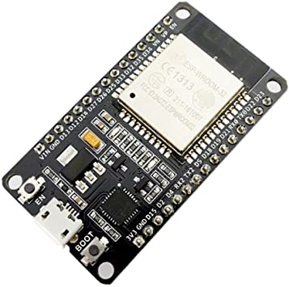

+++
title = "Indoor Location and Cyber Monitoring"
description = "Indoor location system"
date = "2021-11-01"
featured = true

thumbnail = "post/indoor-location/images/belwifistation.jpg"

tags = [
    "indoor", "location", "device"
]
categories = [
    "location"
]

+++

Watching for BlueTooth devices, or Beacon as well as Wifi stations, can be easily done, using a simple ESP32 device.  Several applications of this capability :

- Indoor location
- Presence detection
- Cyber watching the around wifi devices, or stations

<!--more-->

MQTT Iot Stuff published some month ago an ESP32 software (ESP32 promiscuis mode) GitHub repository, monitoring either BLE (Blue Tooth Low energy), and Wifi communication around the ESP32. This monitoring permit to watch the Wifi space and BLE, and grab the emitting information as well as the sender references.

### ESP32 Promiscious mode and BLE scanning

[https://github.com/mqttiotstuff/ESP32_promiscuis_mode](https://github.com/mqttiotstuff/ESP32_promiscuis_mode) project implements a serial device scanning both wifi and ble, and log all the communication signature on a 1 000 0000 bauds serial communication. Scanning all wifi channel and with a 10s BLE scanning, main devices are watched and logger.

We are currently experimenting causual usage of this serial device around with the [https://github.com/mqttiotstuff/MyMQTTNodeIOT](https://github.com/mqttiotstuff/MyMQTTNodeIOT) project for logging and transmitting the information to MQTT Broker. 

Some additional usage of this device and associated software will be published soon for several applications : 

1 -  Wifi device detection, preventing intrusion.

2 - Presence detection and indoor location (3 devices has been setup to create ble triangulation, as well as wifi).

