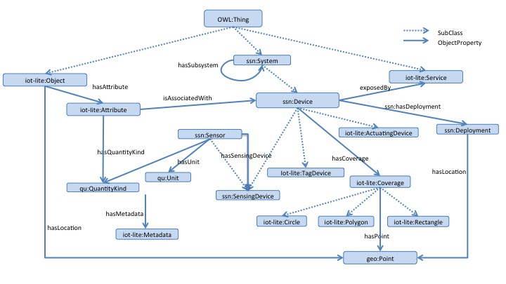
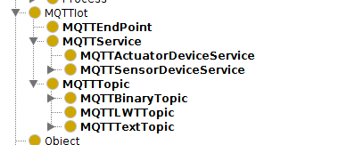
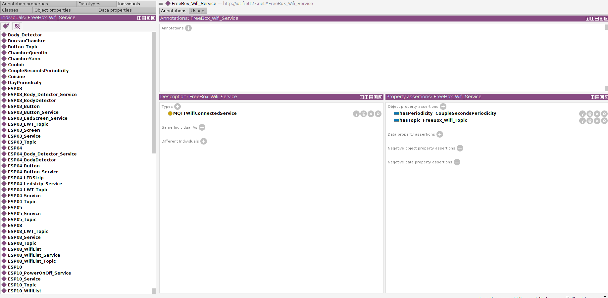

+++
title = "Why Iot System Description, SSN & IOT-Light based onthologies"
description = "Dealing with managing lots of iot systems"
date = "2022-02-27"
aliases = ["semantic-description-iot" ]
author = "Mqtt IOT Stuff"
thumbnail = "post/iot-system-description/images/iot-light-schema.jpg"

tags = [
    "semantic", "rdf", "owl", "xml" "onthology", "device", "ssn", "iot-light"
]
categories = [
    "description", "iot"
]

+++

Creating dictionaries of existing sensors and actuators, leverage their usage to extend their usages for  intelligent ambiant systems. In this article we'll cover the needs and benefits to setup such descriptions, and choosen tools to achieve ambiant and intelligent systems.


<!--more-->


# Iot.frett.net Ontology needs


Living or even dealing with extremly adaptable systems, requires a global description vision and associated dictionaries. Even if these dictionary may seems irrelevant at a first glade. Their existence aims to automatically manage :
- system evolutions
- inventory
- construct new services based on description

These mentionned bullets points are decribed in the follow of this document, to argue why such a description is needed and the benefits of this.


## Managing and handling systems evolutions

Physical devices expose multiple sensors and associated actuators. These small embedded plateforms have their own capabilities, and protocols. When changing, replacing or completing global system with such plateforms, user-oriented services have to be maintained and furnish same informations. (interfaced role orientation).

Maintaining measures from physical sensors needs to be periodically requalified with goldens, if not monitored using other existing references (same kind of measures nearby). 

Be able to query the list and maintainance planning with these aspects

## Inventory

In the extreme Ambiant system flexibility, with multiple protocols, multiple forms of deployments, role of devices, can be tidious to dig into if no global view provided.
The need to have a "whole" picture of what exists and the kind of service, that way the service is also accessed if then key for new software services. 
Description equivalence also help for mastering description diversity.


## Construct new services based on description

The ultimate goal for creating and maintaining the description, is properly achieved in making the system evolving in an exernal way. Separation of description and implementation, permit to create constellation of services implementation, base on the description and specifications. 

Multiple aspects benefit from it. The first one in the monitoring. Describing the communication protocol and some additional behaviour in communication permit to set up software agents to automatically detect failures or badly formed communications. This benefit from both hardware and cyber security. Generally, this quick win pay the time to set it up, or creating it. On other hand, especially on ambiant systems, some sensors can be used for several purposes, for example, temperature sensors can both be used for thermal modeling and also presence detection (human body emit heat a temperature sensor can detect). Body detection can have multiple shapes : ir detection, thermal signature, microwave sensors, ...   


# Description setup for iot.frett27.net/0.1 onthology


In the operational systems implemented here, an onthology based description has been defined. This description use the websemantic tools and provides the several following gains :
- Additive description, with loosely coupled links on description. Some several aspects of description as Physical distribution, Sensors abilities, Communication protocols can be described separately
- Onthologies provides proper vocabularies and description models well performed and settedup by multiple specialist around the globe. 
- Framework tools for description, queries avoiding reinventing the wheel for reuse and speed up the implementations (Sparql, Manathan queries, archiving and distribution)

Two main onthologies are used in this setup : 

[SSN](https://www.w3.org/2005/Incubator/ssn/ssnx/ssn) : Sensor Network onthology, widely used on large systems and firms for maintainance or complex systems description, providing a framework on sensors, properties, harward organization.

And [Iot-Light](https://www.w3.org/Submission/2015/SUBM-iot-lite-20151126/) from W3c consortium, An incubating description model, provide a framework for services provided on IOT systems. This description has been cored in the light profile to ease the implementation and challenge the core elements. 




In the current setup, and additional specific extension has been added for MQTT specific organization, and also associated MQTT services protocol implementations. This permit to organize and have a precise vision of the MQTT broker messages, and way to automate message generation or understanding. Parts of this ontology are still in progress on Smart Home usages (as location, body detection).






# Applications


Using this setup, and illustrate the gains, multiple queries can be answered, here are some examples. On the following perspectives :

- inventory
- hardware composition
- association between services, control and hardware
- protocols to use services (for creating robots)
- querying devices for a given user purpose


**All Theses examples are formulated using Manchester Query syntax**


Which physical objects have body detector ?

```
 PhysicalObject that 'has subsystem' some BodySensorDevice
```

What objects are located in "Salon"  ?

```
 PhysicalObject that 'has deployment' value Salon
```


Which Device are deployed on objects in a specific location ?

```
Device that isSubSystemOf some (PhysicalObject that 'has deployment' value BureauChambre )
```


which device has de button ?

```
 PhysicalObject that 'has subsystem' some ButtonDevice
```


Which objects are son/off plateforms ?

```
SonOffDevice
```


Which objects has PowerOnOFF capabilities ?

```
PowerONOFF
```


Which objets contains sensor device ?

```
 Device that hasPart some 'Sensing Device'
```


Which services exposes some physical object ? (ie : not software ones) 

```
 Service that exposes some PhysicalObject 
```

which services exposes sensors abilities ?

```
 MQTTService that exposes some 'Sensing Device'
```


```
 PhysicalObject that exposedBy some Service
 PhysicalObject that exposedBy some MQTTService
```


Which object exposes devices with MQTT abilities ?

```
 PhysicalObject that 'has subsystem' some (Device that exposedBy some MQTTService)
```


which button device are controllable by a service ?

```
 ButtonDevice that exposedBy some Service
```


what elements compose ESP13 physical system

```
Device that isSubSystemOf value ESP13
```


Which service use a MQTT Tuple on a topic 

```
Service that hasTopic some MQTTTupleTopic
```


same on MQTTColorTupleTopic ?

```
 PhysicalObject that exposedBy some (MQTTService that hasTopic some MQTTColorTupleTopic)
```


or text ?
```
 PhysicalObject that exposedBy some ( MQTTService  that hasTopic some MQTTTextTopic)
```


```
MQTTService that (hasTopic some MQTTTextTopic) and exposes some (Device that 'has deployment' value BureauChambre)
```


```
MQTTService that exposes some (PhysicalObject that 'has deployment' value BureauChambre) 
```


Link between topic and device ?

```
MQTTService that hasTopic some (MQTTTopic that topic value "actuators/led8")
```


which one have a "actuators/relay1" subtopic 

```
Device that exposedBy some (MQTTService that hasTopic some (MQTTTopic that topic value "actuators/relay1"))
```


Which one use a binary on MQTT ?

```
 ButtonDevice that exposedBy some (Service that hasTopic some MQTTBinaryTopic)
```

```
 Device that exposedBy some (Service that hasTopic some MQTTTupleTopic)
```


```
Device that hasSubSystem some (ActuatingDevice that exposedBy some (MQTTActuatorDeviceService that hasTopic some MQTTNumericTopic)  ) 
```


Which one on "chambre" are handled by mqtt ? and actuators/relay1 ?


```
Device that (hasSubSystem some (Device that  exposedBy some (MQTTService that hasTopic some (MQTTTopic that topic value "actuators/relay1")))) and hasDeployment value BureauChambre
```

Buttons in BureauChambre ?

```
Device that (hasSubSystem some ButtonDevice) and hasDeployment value BureauChambre
```


Which one can observe PresenceCorpsHumain ?
```
Platform that hasSubSystem some (Sensor that observes value PresenceCorpsHumain)
```

```
Device that (hasSubSystem some (Sensor that observes value PresenceCorpsHumain)) and hasDeployment value BureauChambre
```


