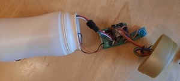
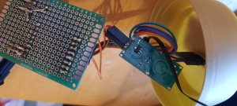
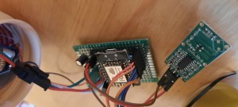
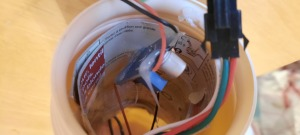
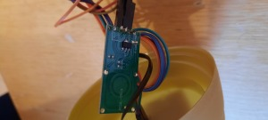
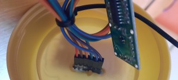
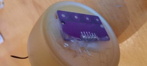
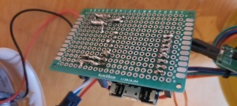

+++
title = "Internal Ledbox prototype pictures, revealed"
description = "LedBox Prototype making of"
date = "2022-06-24"
aliases = ["semantic-description-iot" ]
author = "Mqtt IOT Stuff"
thumbnail = "https://github.com/mqttiotstuff/mqtt-agent-ledbox/raw/master/doc/images/sequence_wave_blue___shift_wave_green___30__.avi.gif"

tags = [
    "ledbox", "led", "mqtt", "device", "ws2812"
]
categories = [
    "description", "iot"
]

+++

It's been a while the ledbox is working, and really gives usefull calm informations each day.  As a new design is currently on progress, here are some revealed  details about the building. 

<!--more-->

The LedBox is a led strip rolled around a carboard and placed into a coffee box. The electronic board is then placed inside the cylinder, with small Buck DC -DC voltage adapter, the ESP microcontroller. A microwave sensor permit to detect bodies and react accordingly. A contactless button array is also added on the top of the box for interactions.

Here are the pictures (click on it to enlarge).

Some details

This article is a following of previous ones, explaining the software, agents associated to its capabilities.  
