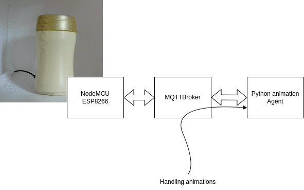
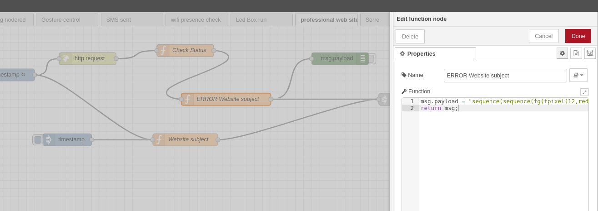

+++
author = "MQTT Iot Stuff Authors"
title = "LedBox language animation building blocks"
date = "2022-01-26"
description = "Alerting, feedbacks and intelligent anbiant systems"
featured = true
tags = [
    "python", "device", "led", "animation"
]
categories = [
    "python", "generators"
]
series = ["Themes Guide"]
aliases = ["ledbox-language"]

# thumbnail = "images/cloud-symbol-inside-a-circle.png"
thumbnail = "https://raw.githubusercontent.com/mqttiotstuff/mqtt-agent-ledbox/master/doc/images/parallel_shift_fg_fring_2_blue___0__shift_fg_fring_1_green____10__shift_sequence_fg_fring_0_uipurple____flash_uipurple____20___sequence_parallel_slow_slow_square_cgcolor_uipurple__4_2_____rain_blue____clear___.avi.gif"

+++

### 

In this more practical followup article, we'll focus on the led language implementation using python. Led box permit to display some led animation using an individually controlled led strip using ws2812 chip.

Hightly configurable animations implementation is shown and presented here,  using `python` generators functions. This article, aims to explain the benefits of such approach in creating the grammar for smart led animations and smart feedback for such devices.

an integration with an interpreter is also explained.


The code referred here in the article is available on [mqttiotstuff/mqtt-agent-ledbox](https://github.com/mqttiotstuff/mqtt-agent-ledbox)


### The device setup, for context

In the device setup, a long string, specifying the led strip rgb tuple, is sent to a lua NodeMCU ESP8266 module. This hardware device only displays the MQTT topic received "long" string, and send it throught the wires to the ws2812 chip, activating the leds. 

The hardware architecture is illustrated below



Animations and commands are sent to the python animation agent, using mqtt (publish/subscribe).


### Why Python ?

Python is still quite simple and accessible to a wide range of developers or hackers. Easy to learn (python is one of the language with the smallest keywords set), and python does not need large tool-chains to start with. Python also benefit from a large community.

Python also offers some interesting features for triggering animations and frames : **generators**

Generators are often used in data science, for cursors (mainly using in panda and other derivative), but also in other areas. Here the generators offers a great way to specify animations, in a simple, and effective way.


### Primitives needed for animations

Before using generators, some functions have been described. We first need some frame construction functions, to provide frame generation primitives. These functions output a string, formatted as : "rgbrgbrgbrgbrgb..." encoding. The length of the rgb tuple depend then on the number of leds existing on the led strip.

As an illustration, these frame's primitives function lighten a specific pixel in the strip, or creating a frame with only a ring (range of pixels) .. other examples can be met in the implementation referred.


These frame's constructor functions can then be combined using composed functions. We can find : the `add` function making a color added operation (and thresholding the result), but also the `combine`function, implemented as below :

```python
    def combine(self, led_frame1, led_frame2):
        """
        mix two led frame
        :param led_frame1:
        :param led_frame2:
        :return:
        """
        return self.add(self.fade(led_frame1), self.fade(led_frame2))
```


### Animate the frames using generators

Python generators can be setted up then for frames, using the functions described above. These generators returned a series of Led Frames (strings), throught the `yield` python function.

This is then possible to create sequences of frames implementation as illustrated below :

```python
    # generator for creating a color flash
    def flash(self, color, speed=5):

        buf = self.feed(self.all_leds, color)
        for i in range(0, speed):
            yield buf

        buf = self.feed(self.all_leds, black)
        for i in range(0, speed + 5):
            yield buf
```

The `feed` method used generate a Led Frame using a single color for all the led in the strip, with the given color. the `flash` generator function, furnish in the implementation 5 frames with the given color, and 5 frames with the black color (meaning, we stop the display).


Ok, why not using for loop, you'll tell ? 

I'd answer then, that generators offers lot more ability for composition. Looking at the ability and readability of generators, this looks obvious seening a simple sequence combination function :

```python

    # generator with a sequence of frames
    def sequence2(self, frame_generator1, frame_generator2):
        if not frame_generator1 is None:
            for i in frame_generator1:
                yield i
        if not frame_generator2 is None:
            for j in frame_generator2:
                yield j
```

 the `sequence2` function takes here two frame_generator functions (as the flash function explained above), and create a new generator, concatenating the two animations. (the second after the first one).

using a parallel combination in not as complex :

```python
    # generator for parallel sequences
    def parallel2(self, frame_generator1, frame_generator2):

        while not (frame_generator1 is None and frame_generator2 is None):
            s = None
            if frame_generator1 is not None:
                try:
                    s = next(frame_generator1)
                except StopIteration:
                    frame_generator1 = None
            s2 = None
            if frame_generator2 is not None:
                try:
                    s2 = next(frame_generator2)
                except StopIteration:
                    frame_generator2 = None
            yield self.add(s, s2)

```

the add function combine the two generators result, playing the animation in parallel.


combinations are also possible, using an additional generators : `shift` , and `clear`

```python

    # shift an animation
    def shift(self, frame_generator1, shift=10):
        return self.sequence(self.clear(shift), frame_generator1)
```

`shift` : delay the animation with a given number of black pre-frames . `clear` generate a black frame.

Nota: sequence has the same purpose of sequence2, but take variable parameters, to sequence multiple frame generators


Fast / Slow is also possible, stripping some frames or duplicate somes :

```python
    def slow(self, frame_generator):
        for f in frame_generator:
            yield f
            yield f

    def fast(self, frame_generator):
        i = 0
        for f in frame_generator:
            if i == 0:
                yield f
            i = (i + 1) % 2
```


### Combine them all

Some simple combination can then be setted up to make real animations, 

a moving up and down ring :

```
display(ledring.sequence(movering(1,l2), movering(1,l2)))
```


a gallery of some animations (a couple) is available here : (sorry for the auto regulation of the web cam used, this stress the eyes in the watching).

[https://github.com/mqttiotstuff/mqtt-agent-ledbox/blob/master/doc/gallery.md](https://github.com/mqttiotstuff/mqtt-agent-ledbox/blob/master/doc/gallery.md)


### Accessing the function throught a simple interpreter

As mentionned in the introduction, the display use MQTT for communication. 

In order to trigger custom animation from mqtt message, an interpreter is added to the stack. The interpreter used is `expression`

```
import expression
```

...

`parseExpression` convert then a string into python code (with limited functions provided). 

```

def parseExpression(ledexpression):

    functions= {
                "sequence": ledring.sequence,
                "slow": ledring.slow,
                "fast": ledring.fast,
                "parallel": ledring.parallel,
                "parallel2": ledring.parallel2,
                "shift": ledring.shift,

                "cglinear": ledring.linear_color,
                "cgcolor": ledring.fixed_color,
                "cgrainbow": ledring.rainbow_color,
                # switch colors at each step
                "cgswitch": ledring.switch_color,


                #### Frame constructor functions
                "fg" : ledring.fg,
                # 
                "fpattern": ledring.fill_patterns,
                "fadd": ledring.add,
                "fpixel": ledring.pixel,

                "fring": ledring.ring,
                "fdots": ledring.dots,


                ### Frame generator functions

                # clear
                "clear": ledring.clear,

                # take color, and speed (default to 5)
                "flash": ledring.flash,

                # take color
                "rain": ledring.rain,

                # create square patterns, take color generator, nbpatterns, square pattern size, and shift
                "square": ledring.colored_square,

                # random dots moves
                "random": ledring.randomDotColor,

                # dots animation
                "dotanim": ledring.dotAnim,

                # dot animation with color generator
                "dotanimcg": ledring.dotAnimCg,

                # take direction, and associated color
                "movering": ledring.movering,
                
                # take colors
                "wave": ledring.wave
            }
    
    variables = { 
        "black":black,

        "green":green,
        "red":red,
        "blue":blue,
        "white":white,

        # colors from https://materialuicolors.co/
        "uipink":uipink,
        "uired":uired,
        "uiblue":uiblue,
        "uilightblue":uilightblue,
        "uipurple":uipurple,
        "uideeppurple":uideeppurple,
        "uiindigo":uiindigo,
        "uicyan":uicyan,
        "uiteal":uiteal,
        "uigreen":uigreen,
        "uilightgreen":uilightgreen,
        "uilime":uilime,
        "uiyellow":uiyellow,
        "uiamber":uiamber,
        "uiorange":uiorange,
        "uideeporange":uideeporange,
        "uibrown":uibrown,
        "uigrey":uigrey,
        "uibluegrey":uibluegrey}


    parser = expression.Expression_Parser(variables=variables, functions=functions,
                                          assignment=False)
    e = parser.parse(ledexpression)
    return e

```


### Some pragmatic usage examples :

When my professionnal website, does not respond, a specific animation is sent to the ledbox :



string sent on the agent /run topic, connected to the interpreter :

```
sequence(sequence(fg(fpixel(12,red)), fg(fpixel(11,green)), fg(fpixel(10,blue))), sequence(dotanim(red,2,5), slow(sequence(flash(red), clear(), flash(red)))))
```


When running out of space on the system, an other animation is sent, providing a separate feeling in the feedback.

```
parallel(parallel(dotanim(red, 1, 11),rain(blue)), dotanim(green,1,9))
```


### The display main loop, for curious

Running the frames, needs a main loop, with a care attention to mqtt clients, and threading, to preserve animations :

```python

class MainThread(threading.Thread):
    def run(self):
        global client2
        global username
        global password
        global mqttbroker
        count = 5
        client2 = mqtt.Client(clean_session=True, userdata=None, protocol=mqtt.MQTTv311)
        client2.username_pw_set(username,password)
        client2.connect(mqttbroker, 1883, 5)
        client2.will_set("home/agents/ledbox/lwt", payload="disconnected", qos=0, retain=False)

        client2.loop_start()
        print("init done")
        currentGenerator = None
        cptwatch = 0
        while True:
            try:
                s = None
                if currentGenerator != None:
                    try:
                        s = next(currentGenerator)
                        assert len(s) == ledring.all_leds * 3
                    except StopIteration:
                        currentGenerator = None

                if s is not None:
                    count = 5

                if s is None:
                    count = count - 1
                    if count > 0:
                        s = ledring.feed(ledring.all_leds, (0,0,0))

                if s is not None:
                    ledring.display(client2,s)

                try:
                    # pump generator and combine with previous if exists
                    incomingGenerator = generatorQueue.get(timeout=0.005)
                    assert incomingGenerator != None
                    currentGenerator = ledring.parallel(currentGenerator, incomingGenerator);
                except queue.Empty:
                    pass
            except:
                traceback.print_exc()
            time.sleep(0.1)
            cptwatch = (cptwatch + 1) % 100
            if cptwatch == 0:
                client2.publish(WATCHDOG_TOPIC, "1")


mainThread = MainThread()
mainThread.start()

```


### The ending words

Using this ledbox, is really comfortable, and adding new animations change the way the ledbox is used. Hoping this approach and share can invite to hack you own ledbox. 


All current code is available on the github repository,  [mqttiotstuff/mqtt-agent-ledbox](https://github.com/mqttiotstuff/mqtt-agent-ledbox)

feel free to add your contributions, or feedbacks.  


