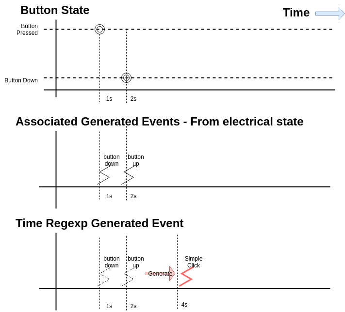
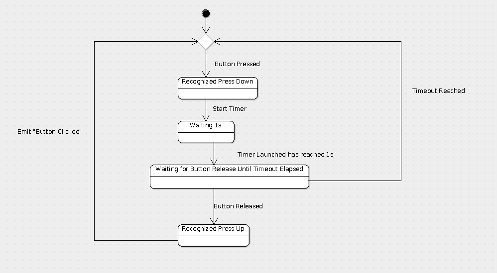

+++
title = "Time Expression RegExp triggers to enhance global control"
description = "Add more capabilities to context, buttons and feedback"
date = "2021-10-31"
aliases = ["event-time-base-triggers" ]
author = "Mqtt IOT Stuff"
thumbnail = "post/time-regexp-expression/images/tregexp.png"

tags = [
    "time", "python"
]
categories = [
    "tools",
]

+++

`Compilation and Language Theory` is a way to transform "Low level" informations into a more evolved action. This ability, in ambiant systems context,  leverage the synthetization of a couple of actions or "events", into a more human understandable action. This decomposition lead to more evolved semantic that can help design more sophisticated logics.

Applications of this is to enhance and extend existing actuators, and triggering timed based actions or events. Using a Button for example, long press button, or sequences of buttons can be transformed in actions, in the same way the [Morse Code](https://fr.wikipedia.org/wiki/Code_Morse_international) has been setted up in the 19th century for transmissing Textual messages, using a simple tone.

 

<!--more-->

### Bases of Timed Regular Expression patterns context using an example

In the understanding of the Timed Regular Expression grammar, we can easily start with a simple example, and details the needs for expressing such logics.

In the proposed didactic example, a sequence of two events (up and down) on a button can be transformed to a "simple click" event.



In this example a couple of events (down and up), is synthetized into a simple event, meaning the button has been pressed once, shortly. We can see here, in this pipeline transform,  that multiple events can be  synthetize in a unique event representing the "button down, wait 1s, button up" `evented time pattern` given a unique  `simple click` named event.


In implementation, this kind of compilation process is usually done using a [finite state machine](https://en.wikipedia.org/wiki/Finite-state_machine). This automata manage states in the recognition, and emit some events in some transition. In this upper case, the "simple click" generated event is triggered when the first "button down" event is fired and the second "button up" event is recognized GIVEN a minimum time lapse. 

This internal automata can be represented as below, using UML representation :



We can see timeout intermediary states in automata,  introducing here some __time constraints__  for accepting properly the following "button up" event in the sequence. This insure a  minimum of `1s wait`  between the first, and the second event recognition.


#### Link with time

Defining some regular expression, every events place in time must be enclosed by time segment [min - max] to be able to match practical applications.  

Then, finite state machine can be constructed from regular expression introducing the timed additional states. 


## Introducing Timed Regular Expression grammar

Regular expression definition rely here on a EVENTPATTERN , which can be fixed given set of vocabulary defining the events either some condition to match the transition between the several states. 

For simplicity reason, in this fist description, the events are part of a fixed set. Fixed event are encoded in a simple string. 


### TRegExp (Time regular expression) definition and model

Time pattern is expressed using a sequence of TimeTuple, expressing the start listening of the event and the wait possible time to grab the event. 


TimedPattern : `[` TimeTuple, TimeTuple, TimeTuple ....   `]`

TimeTuple: `([minTimeFromLastEvent, waitTime], EVENTPATTERN)`

​     NOTA : times are expressed in relative time from the previous event

EVENTPATTERN: condition to match the event from ordered event queue. 

Currently EVENTPATTERN is the **name of the event**, or use `^`EVENTNAME for negation


**Operators** 

.  : sequence of timed patterns

| : alternatives, expanded in multiple patterns

{min, max} : fixed repetitions, MAX must be a fixed number


Examples :

```
[0,0]BUTTONDOWN, [0.8,1.2]BUTTONUP
```

means a button push, with 0.8 - 1.2 button pressed time.

```
[0,0]BUTTONDOWN, [0,0.8]^BUTTONUP, [0,0.4]BUTTONUP
```


## Home automation applications

- Button enhancement for getting more commands from one device
- Multiple event conjonctions detections, correlate multiple sensors with time constraints, 
  - geeting to know a person is in a room
  - getting to know a person is moving from several rooms


### Simple Parsing python implementation

a first simple implementation of this timed event regular pattern expression is done in [tregexp](https://github.com/mqttiotstuff/mqtt-agent-tregex) repository. (without operators).